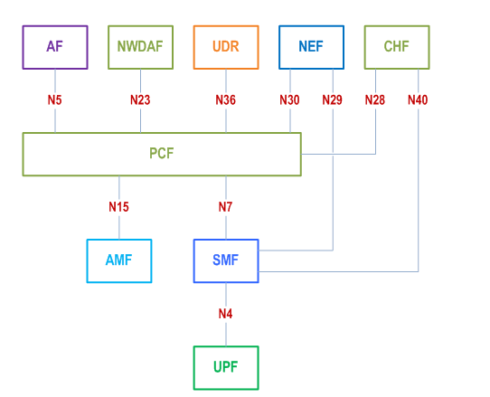

# PCF_Simulation_Tool
PCF SIMULATION TOOL - IT TESTS THE 5G PCF API'S

## Go through :
UE TO RAN CALL FLOW - https://github.com/mahindragajjala/PCF_Simulation_Tool/blob/main/PCF/Registration/UE_TO_RAN.md

AMPOLICY - https://github.com/mahindragajjala/PCF_Simulation_Tool/tree/main/PCF/services/AM_Policy

SMPOLICY - https://github.com/mahindragajjala/PCF_Simulation_Tool/tree/main/PCF/services/SM_Policy

BDTPOLICY - https://github.com/mahindragajjala/PCF_Simulation_Tool/tree/main/PCF/services/BDT_Policy

AUTHORIZATIONPOLICY - https://github.com/mahindragajjala/PCF_Simulation_Tool/tree/main/PCF/services/AuthorizationPolicy

EVENTEXPOSUREPOLICY - https://github.com/mahindragajjala/PCF_Simulation_Tool/tree/main/PCF/services/Event_Exposure

Policy and charging control framework - https://github.com/mahindragajjala/PCF_Simulation_Tool/tree/main/PCF/services/Policy_and_charging_control_framework
